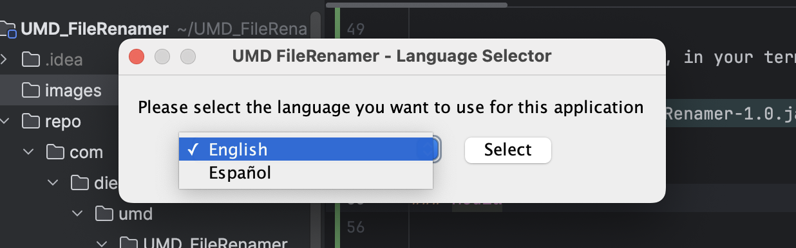
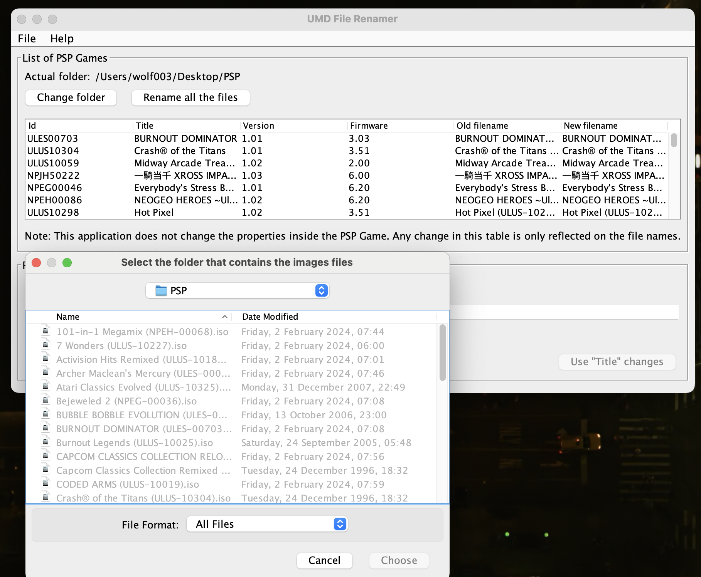
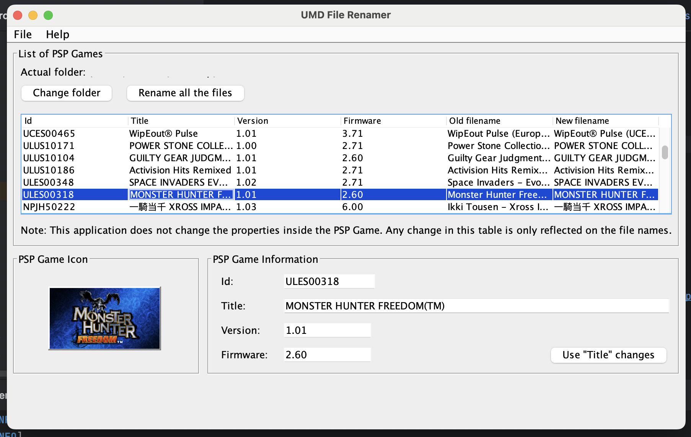
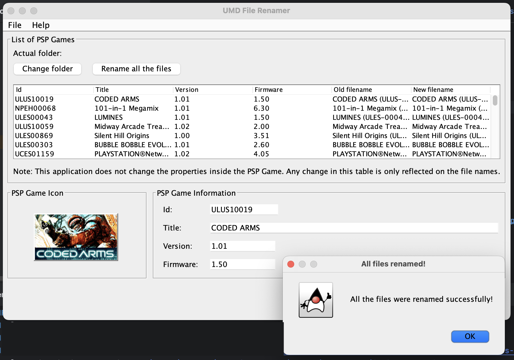

# UMD File Renamer

### Changes 
(only tested on macOS)          :
> **Replaced the unsafe (security issues) log4j plugin with the latest safe version and added the log4j core dependency.**                 
```xml
        <dependency>
            <groupId>org.apache.logging.log4j</groupId>
            <artifactId>log4j-core</artifactId>
            <version>2.17.1</version> <!-- Use the same version as log4j-api -->
        </dependency>
```
```xml
        <dependency>
            <groupId>org.apache.logging.log4j</groupId>
            <artifactId>log4j-api</artifactId>
            <version>2.17.1</version>
        </dependency>
```

> **Added some changes to the pom file to get rid of some errors, when building the app, one of them is this:**           
```xml
            <plugin>
                <groupId>org.apache.maven.plugins</groupId>
                <artifactId>maven-project-info-reports-plugin</artifactId>
                <version>3.5.0</version>
            </plugin>
```
> **Cleaned-up the code, because a lot of stuff was unnecessary, could be simplified and/or was deprecated.**   

> **Used corretto-18.0.2 to compile the code.**                  

```xml
<configuration>
    <source>1.8</source>
    <target>1.8</target>
</configuration>
```

> **Changed branch-name from "master" to "main".**                          

> **Fixed some typos.**                 

> **If making changes to the repository make sure to run 'mvn clean package' first before running the app again.**              

> **Locate the app here: [UMD_FileRenamer](./target)**                

---


**To run the app on macOS, locate the app and double click on it or in your terminal type:**
```bash
java -jar target/UMD_FileRenamer-1.0.jar
```

### Media



---

                      

---

                      

---

                  

---

## Official GitHub port
Hello, [Diego Hernández](https://github.com/iampeluca) here.  
I'm the original creator of the **UMD File Renamer** published on Google Code at https://code.google.com/archive/p/umd-file-renamer/ back on June 3rd, 2012. This is the first time I officially publish this code on GitHub.

Back on 2012, thanks to a couple of articles published by Softpedia (https://mac.softpedia.com/get/Games/UMD-File-Renamer.shtml and another link broken by now), we were able to record more than 300 downloads!

This project will be rebranded using `BrosMakingSoftware` name, in order to keep it alive and add improvements to it.

Thanks everyone for the support, I really appreciate it.  
I hope this application can help you keep your game collection organized.

## Original description
This application reads ISO or CSO files and extract their information to generate a recognized and standard file name, without changing the properties inside the PSP games. Some classes of jpcsp project are used, jpcsp is an open source Java emulator of PlayStation Portable console system. See http://jpcsp.org/ for more information, code can be downloaded from http://code.google.com/p/jpcsp/. This application is partially based and inspired on [UmdBrowser](http://code.google.com/p/jumdbrowser/), an application to list and navigate into UMD images.

The code is written in Java using the latest Swing Layout library, so this desktop application can use the OS native interface (tested on Mac OSX, Windows and Linux/Ubuntu) and run on all of them. It comes in 2 languages: English and Spanish, you are able to choose it when the app starts. The IDE used to create this project was Netbeans 7.1, but it is a Maven project, so you are able to open this project in any IDE that supports Maven. If you want to see a detailed log of the actions of the app, run it from a terminal (or console) and check the outputs (log4j was implemented for this purpose).

Java JRE 6+ is required. All required libraries are included to be more portable.
